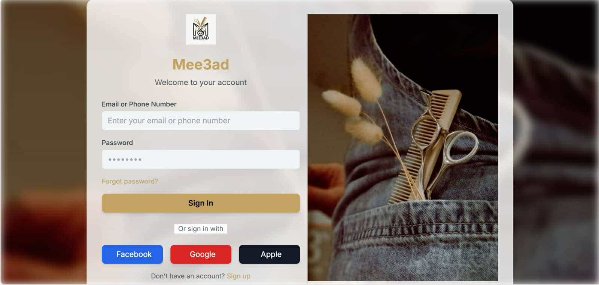

# Mee3ad Login Page

## 📌 Project Overview
This is a **React-based Login Page** designed to demonstrate my **frontend development skills**. The task required creating a login page inspired by an existing design, aligning with **Mee3ad's real website theme** while ensuring a great **UI/UX experience**. 

## 🛠 Technologies Used
- **React** (with Vite for fast development)
- **Tailwind CSS** (for styling and responsiveness)
- **UI/UX Principles** (applied from my training)

## 🎯 Features
✅ Responsive login form  
✅ Matching colors and theme with the **Mee3ad** app  
✅ Social login buttons (Google, Facebook, Apple)  
✅ Background blur effect for enhanced design  
✅ Mobile-friendly UI  

## 📸 Project Screenshot


## 🚀 Installation & Usage
Follow these steps to run the project locally:

```bash
# Clone the repository
git clone https://github.com/your-username/mee3ad-login.git

# Navigate into the project folder
cd mee3ad-login

# Install dependencies
npm install

# Start the development server
npm run dev
```

Now, open your browser and visit **`http://localhost:5173`** to see the login page in action! 🎉

## 📂 Project Structure
```
mee3ad-login/
│── src/
│   ├── assets/
│   │   ├── me3ad_app.jpg  # Project screenshot
│   │   ├── dark-logo.jpeg  # Logo used in the login page
│   │   ├── login-background.jpg  # Background image
│   ├── components/
│   │   ├── Login.jsx  # Login component
│   ├── App.jsx  # Main app file
│   ├── main.jsx  # React entry point
│── public/
│── package.json
│── vite.config.js
│── README.md  # This file
```

## 📢 Why This Project?
I built this project as part of a **frontend developer evaluation** to showcase my ability to:
- **Analyze** existing designs and implement them accurately
- **Work with new technologies** like Tailwind CSS effectively
- **Apply UI/UX best practices** to ensure a smooth user experience

## 🎉 Outcome
This project helped me **secure an offer as a Frontend Developer** 🚀. It demonstrates my capability to work in a team, learn new technologies, and create high-quality UI components.

---
💡 **Let's connect!** If you have feedback or suggestions, feel free to reach out! 😃

